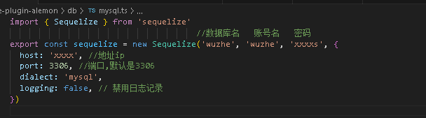

# 武者文游

 
### 介绍

这是一个武者文游的插件


### 访问量
<br><br>
### 安装教程

输入命令:<br>  
在云崽根目录输入以下命令
````
git clone https://gitee.com/xyb12345678qwe/wuzhe-plugn-alemon.git ./plugins/wuzhe-plugin-alemon/

npm i md5
npm i js-yaml

````

### 使用说明

请先配置数据库mysql,地址`plugin/wuzhe-plugin-alemon/db/mysql`里配置mysql个项数据,配置完后导入提供的sql文件



sql文件:


请安装插件后对机器人输入`#武者帮助`，查看可用功能


### 交流群

QQ群：无


### 作者相关

作者: 名字
个人博客: [戳我前往](https://boke.mzswebs.top/) 

### 额外说明

本插件禁止用于盈利

觉得功能少的可以反馈给作者~

作者一个人写这个插件，且作者是学生，更新会比较慢

有想来自愿开发的可以来找作者